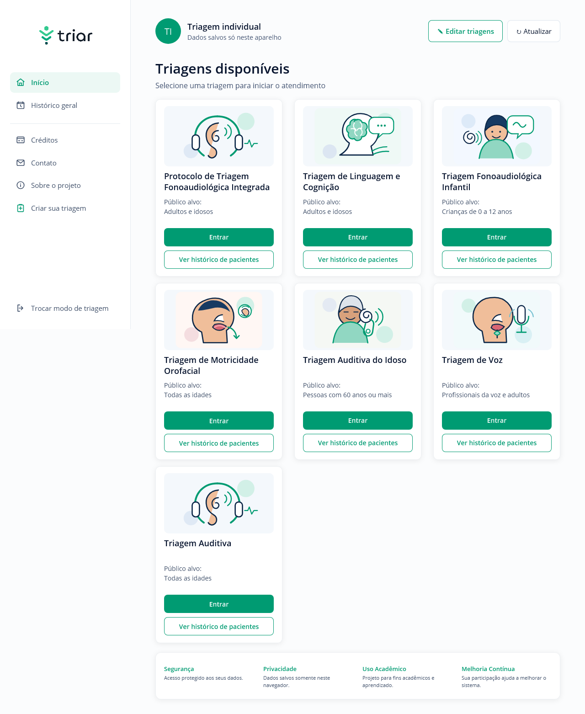
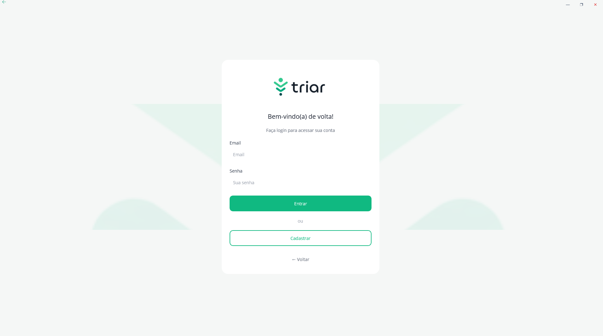
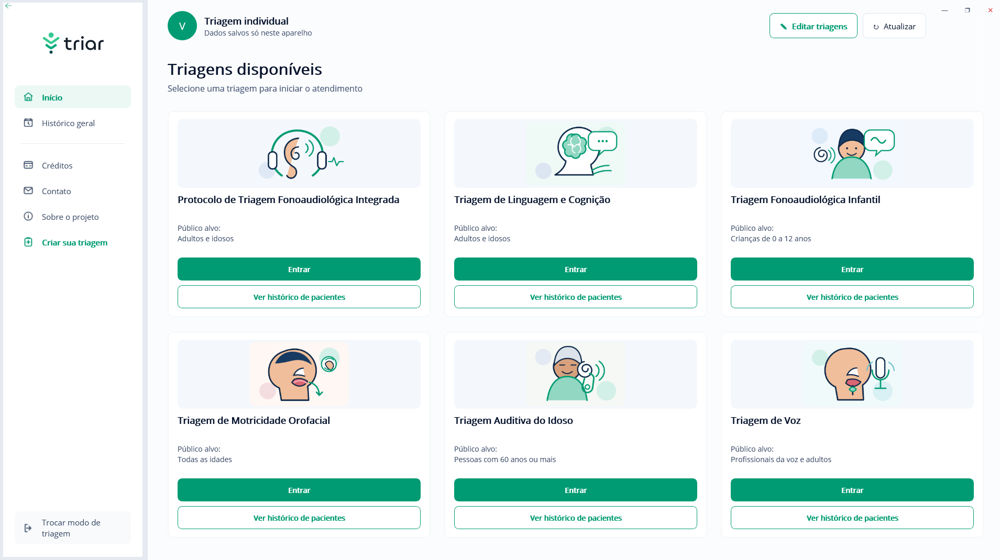
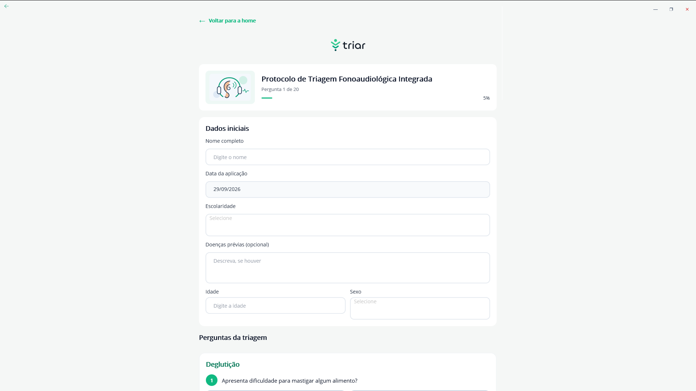
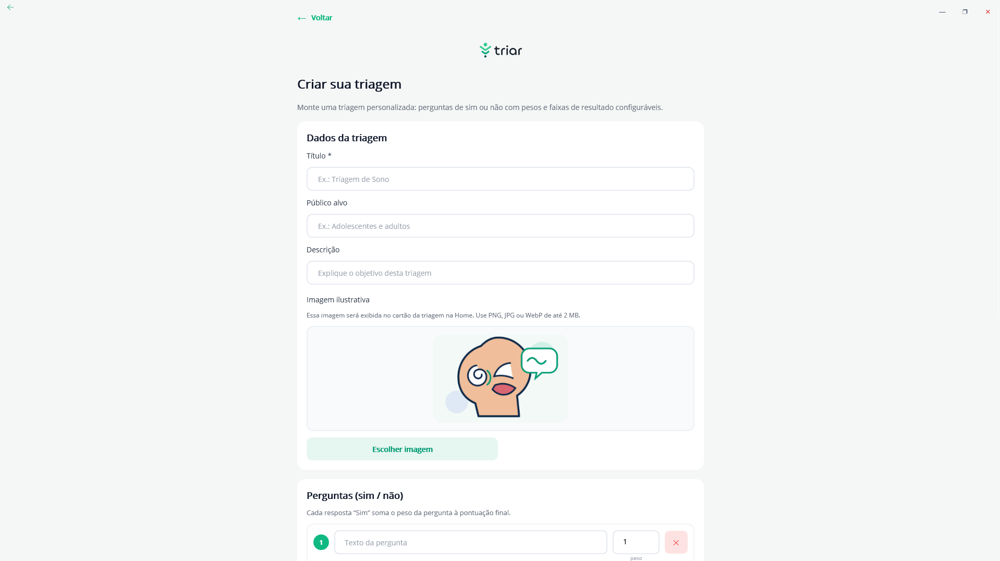
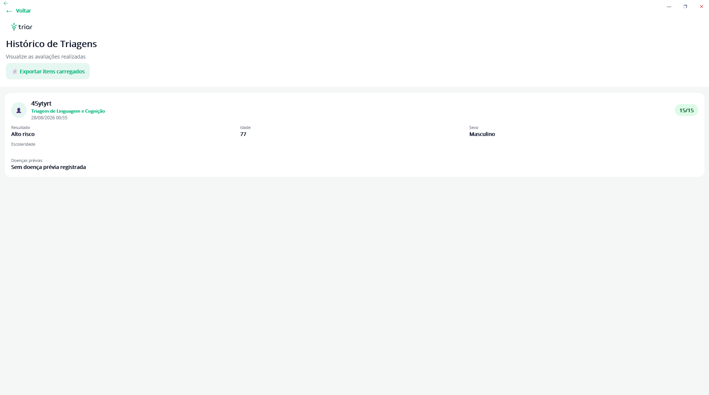
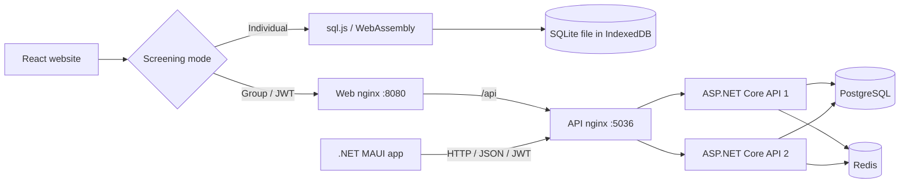
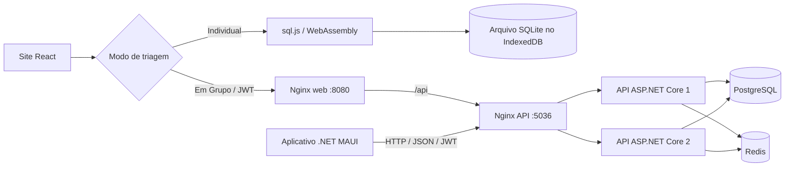

# Triar

**Guided health screening through a .NET MAUI app and a React website, with local or API-backed storage.**

[English](#english) | [Português](#português)




*React website / Site React. Native app screenshots below / Capturas do aplicativo nativo abaixo.*

## English

### Overview

Triar brings questionnaires, weighted scoring and assessment history into one workflow. It includes a **C# / XAML .NET MAUI application**, a separate **React / TypeScript website**, and an **ASP.NET Core API**.

The native project targets Android, Windows, iOS and Mac Catalyst. Intended distribution is Android, Windows and macOS, with the website providing browser access on iOS and other platforms.

> Academic prototype under development. The catalog is not clinically validated; results are educational and must not guide diagnosis, treatment or urgent-care decisions.

### The problem it addresses

Paper questionnaires and separate spreadsheets make consistent scoring and follow-up harder. Triar combines configurable questions, result ranges and history, with a local web workflow when an account or API connection is unnecessary.

### Key features

- **MAUI app:** registration, sign-in, screening dashboard, patient forms, progress, weighted results, custom questionnaires, history and Excel export.
- **Website:** responsive desktop/mobile layouts using the app's visual identity, with an initial Individual / Group choice.
- **Individual web mode:** no login or API calls; real SQLite in the browser, persisted in IndexedDB. Download a database backup from About.
- **Group web mode:** JWT sign-in and PostgreSQL through the API; custom screenings and history belong to the authenticated user.
- **Catalog:** seven default protocols in the API/site, including speech-language, hearing and voice assessments; yes/no and predefined multiple-option questions.
- **Customization:** create, edit or deactivate owned questionnaires, configure weights/result ranges and select dashboard screenings.
- **Results:** patient details, score, classification and recommendation; per-screening and overall history with XLSX export.
- **Offline website:** production assets are cached after the first complete load; Individual uses local data. Group requires connectivity.

### Screenshots

The five native screenshots below were recovered from the earlier README. They document the MAUI interface used as the website's visual reference, not React screens. The main image above was captured from the implemented website.

<table>
  <tr>
    <td align="center"><strong>MAUI · Sign in</strong><br></td>
    <td align="center"><strong>MAUI · Dashboard</strong><br></td>
  </tr>
  <tr>
    <td align="center"><strong>MAUI · Screening form</strong><br></td>
    <td align="center"><strong>MAUI · Questionnaire editor</strong><br></td>
  </tr>
  <tr>
    <td align="center"><strong>MAUI · History</strong><br></td>
    <td align="center">React website preview at the top of this README.</td>
  </tr>
</table>

### Tech Stack

| Area | Technologies |
|---|---|
| Backend | C#, .NET 10, ASP.NET Core Web API, Entity Framework Core 10, Npgsql, JWT Bearer, OpenAPI |
| Frontend — native | .NET MAUI, C#, XAML, HttpClient; Android, Windows, iOS and Mac Catalyst build targets |
| Frontend — web | React 19, TypeScript 5.9, React Router 7, Vite 7, HTML/CSS, service worker |
| Database | PostgreSQL 17; SQLite through sql.js/WebAssembly and IndexedDB for Individual web mode; EF Core SQLite for the alternative API deployment |
| Infrastructure | Docker, Docker Compose, nginx static hosting/reverse proxy/load balancing, Redis 7 shared cache |
| Tools | Node.js 24 in the web build image, npm, .NET CLI, PowerShell, Playwright (Chromium/WebKit), ClosedXML and write-excel-file for XLSX |

[Firebase App Distribution scripts](deploy/firebase/README.md) support Android testing distribution; Firebase is not the API host. `database/script.sql` is a historical SQL Server reference, not the active Compose database.

### Architecture

Connected clients share the API, PostgreSQL and Redis. The web nginx serves the SPA and proxies `/api` to another nginx balancing two API instances. MAUI calls that API entry point directly. Individual web operations use SQLite in the browser.

**Checkout boundary:** the MAUI `ApiService` here uses HTTP; the browser's local adapter is not wired into the native app. Screenshots from the newer native interface are retained as visual references.



**Backend:** Controllers → services → EF Core DbContext → database. DTOs define contracts; services handle validation, scoring, ownership and caching. There is no separate repository layer.

**Website:** React screens → `src/api.ts` → HTTP API or `src/local-db.ts`, according to mode. `src/models.ts` defines contracts; `src/local-excel.ts` handles local exports.

### Repository layout

```text
TriarCompleto/
├── Triagem.App/MauiApp3/          # MAUI app, XAML, HTTP client
├── Triagem.Web/                  # React website, local SQLite
│   ├── src/                      # Screens, contracts, data adapters
│   ├── public/assets/            # Fonts, logo, illustrations
│   └── tests/                    # Playwright scenarios
├── Triagem.API/Triagem.API/
│   ├── Controllers/              # HTTP routes
│   ├── Services/                 # Scoring, authentication, cache
│   ├── Data/                     # DbContext, seed, schema upgrades
│   ├── Models/                   # Persistence entities
│   └── Dtos/                     # API contracts
├── scripts/                      # API verification, catalog export
├── deploy/nginx/                 # Proxy configurations
├── deploy/firebase/              # Android distribution
├── docs/images/                  # Real screenshots
├── database/script.sql           # Historical SQL Server reference
├── docker-compose.yml            # Main PostgreSQL deployment
└── docker-compose.individual.yml # Alternative server-side SQLite
```

### Technical decisions

| Decision | Purpose and tradeoff |
|---|---|
| Separate MAUI and React clients | Native/browser access share the connected API; UI implementations remain independent. |
| Mode-based web adapter | Reuse screens without sending Individual data to the API. |
| SQLite + IndexedDB | Relational local storage without an account; clearing browser storage removes the database. |
| EF Core + Npgsql | Map entities/relationships to PostgreSQL, with an alternate SQLite API provider. |
| JWT and token-derived ownership | Resolve records from authenticated identity rather than route user IDs. Passwords use salted PBKDF2 hashes. |
| Redis shared cache | Share cached data and invalidate versioned keys across APIs; memory cache is the fallback without Redis. |
| Docker + nginx | Reproduce six services, serve assets and distribute API traffic; health checks coordinate startup. |
| Catalog export and additive upgrades | Generate web defaults from C# and add supported fields without dropping history. Startup uses `EnsureCreated` and a targeted upgrade, not versioned EF migrations. |

### Engineering Highlights

- REST integration with native/web clients, DTOs and typed frontend contracts.
- Relational modeling, foreign keys, unique email indexes and composite dashboard preferences.
- Dependency injection, service-layer scoring, validation and error handling.
- JWT, ownership checks, PBKDF2 and API/authentication rate limiting.
- SQLite transactions, IndexedDB persistence, exports and offline asset caching.
- Multi-stage Docker builds, nginx routing, health checks and cache invalidation.
- Browser scenarios and API assertions for successful and rejected operations.

### Main API endpoints

Data routes require `Authorization: Bearer <token>`. Registration, login, `/health` and OpenAPI are public in this checkout.

| Method | Endpoint | Purpose |
|---|---|---|
| POST | `/api/auth/register` | Create an account and return JWT |
| POST | `/api/auth/login` | Authenticate and return JWT |
| GET | `/api/triagens` | List default/owned questionnaires |
| GET | `/api/triagens/{id}` | Read questions and result ranges |
| POST | `/api/triagens` | Create a questionnaire |
| PUT / DELETE | `/api/triagens/{id}` | Edit/deactivate an owned questionnaire |
| POST | `/api/triagens/{id}/responder` | Validate, calculate and save a result |
| GET | `/api/triagens/{id}/historico` | User's screening history |
| GET | `/api/triagens/{id}/historico/excel` | XLSX; `id=0` exports overall history |
| GET | `/api/triagem/usuario/{usuarioId}` | Legacy overall history; identity comes from JWT |
| PUT | `/api/usuarios/{usuarioId}/home` | Preferences for the token's user |
| GET | `/health` | Database health check |
| GET | `/openapi/v1.json` | OpenAPI specification |

### Database

| Entity | Responsibility |
|---|---|
| `Usuario` | Account, unique email, password hash |
| `TriagemModelo` | Default/custom questionnaire, active state, ownership |
| `Pergunta` | Text, category, options, weight, order |
| `FaixaResultado` | Score interval, classification, color, recommendation |
| `UsuarioTriagemHome` | User/questionnaire visibility and ordering |
| `TriagemResultado` | Patient details, date, calculated result |
| `RespostaDada` | Yes/no answer or selected options |

Questionnaires have questions/ranges; assessments belong to a user/questionnaire and contain answers. Patient details live in results, not a separate patient registry.

Browser SQLite stores equivalent local workflow data and result snapshots. **No automatic PostgreSQL synchronization.** Use **About → Download SQLite backup** before clearing browser data. PostgreSQL uses a Docker volume; `down -v` deletes it.

### Run locally

#### Prerequisites

- Docker Desktop with Linux containers and Compose for the complete stack.
- Node.js 24/npm for the website; .NET 10 SDK for API/native development.
- Visual Studio with MAUI workload for Windows/Android; Android SDK/emulator, or a compatible Mac with Xcode for Apple targets.
- PowerShell for environment setup and API verification below.

#### Website and backend — Docker

From the root, copy the template only if `.env` is absent:

```powershell
if (-not (Test-Path .env)) { Copy-Item .env.example .env }
```

Set your values, keep `.env` untracked and replace the template placeholders:

| Variable | Required by | Purpose |
|---|---|---|
| `JWT_KEY` | Both Compose configurations | Random signing key, minimum 32 characters |
| `POSTGRES_PASSWORD` | Main Compose | PostgreSQL password |

```sh
docker compose up -d --build --wait
docker compose ps
```

Website: **http://localhost:8080**; MAUI API: **http://localhost:5036**; schema: **http://localhost:5036/openapi/v1.json**. Both web modes are available on the first screen.

Stop without deleting the database with `docker compose down`. The SQLite **API server** alternative is documented in [Triagem.Web/README.md](Triagem.Web/README.md); it is unnecessary for browser Individual mode and uses the same ports.

#### Website development

Keep the Docker API running for Group; Individual works without it.

```sh
cd Triagem.Web
npm ci
npm run dev
```

Open **http://localhost:5173**. Vite proxies `/api` to port 5036. `npm run build` checks TypeScript and generates production assets. The service worker is production-only.

#### API without Docker

Provide `Jwt__Key`, `Database__Provider` (`PostgreSQL` or `SQLite`) and `ConnectionStrings__DefaultConnection`; Redis is optional via `ConnectionStrings__Redis`. ASP.NET does not automatically read the Compose `.env`.

For a SQLite API, configure a random JWT key through your shell/secret manager, then run from the root with port 5036 free:

```powershell
$env:Database__Provider = 'SQLite'
$env:ConnectionStrings__DefaultConnection = 'Data Source=triar-local.db'
dotnet run --project Triagem.API/Triagem.API --no-launch-profile --urls http://localhost:5036
```

This stores connected API data in SQLite; the main Compose uses PostgreSQL.

#### MAUI application

Open `TriarCompleto.slnx` in Visual Studio, set `MauiApp3` as startup project and choose Windows or an Android emulator. With SDK/workloads installed:

```sh
dotnet build Triagem.App/MauiApp3/MauiApp3.csproj -f net10.0-android -c Debug
```

`Services/ApiService.cs` uses `http://localhost:5036` in desktop Debug and `http://10.0.2.2:5036` for the Android emulator. Physical devices need a reachable API; review `BaseUrl`/`UrlProducao` before Release distribution. See the [Android signing/distribution guide](deploy/firebase/README.md).

#### Verification and catalog generation

With the production website on port 8080:

```sh
cd Triagem.Web
npm ci
npm exec -- playwright install chromium webkit
npm run test:e2e
```

Tests cover mode selection, Group login gating, local scoring/persistence, Excel/SQLite downloads, no Individual API calls, mobile overflow, offline reload and blocked storage.

From the root, use a **test database**: the API script creates accounts/assessments.

```powershell
powershell -NoProfile -ExecutionPolicy Bypass -File scripts/verify-web-api.ps1 -BaseUrl http://localhost:5036
```

Regenerate the web catalog from C#:

```sh
dotnet run --project scripts/ExportCatalog -- Triagem.Web/src/default-triages.json
```

### Challenges & Learnings

- Reusing web workflows while keeping Individual data out of API requests.
- Exporting C# defaults to JSON to maintain catalog consistency.
- Adding categories/options/patient fields without dropping historical results.
- Coordinating API startup and shared Redis cache invalidation.
- Browser differences: offline reload passes in Chromium, but WebKit automation has an internal navigation error; physical iPhone/Safari verification is pending.

### Roadmap

- [x] MAUI connected client and separate responsive React website.
- [x] Browser SQLite Individual and API-backed Group modes.
- [x] Default/custom questionnaires, scoring, history and XLSX.
- [x] PostgreSQL/Redis Docker topology and browser/API verification.
- [ ] Shared cloud deployment with HTTPS and backups.
- [ ] Design SQLite/cloud synchronization.
- [ ] Verify offline workflow on physical iOS devices.
- [ ] Professional content/scoring validation before clinical use.

### Project status

Academic prototype in active development. Latest functional verification completed Docker build/startup and 17 API assertions; 7 of 8 browser executions passed, with offline WebKit navigation unresolved. No production capacity, clinical certification or deployed cloud environment is claimed. CI workflows and xUnit projects from other repository versions are absent from this checkout.

### Author

**Rodrigo Tabaldi**

Software Engineering student focused on Backend Development, .NET and Full Stack applications.

[GitHub repository](https://github.com/RodrigoTabaldi/TriarCompleto)

---

## Português

**Triagens em saúde com aplicativo .NET MAUI e site React, com armazenamento local ou conectado à API.**

### Visão Geral

O Triar reúne questionários, pontuação ponderada e histórico de avaliações em um só fluxo. Inclui um **aplicativo .NET MAUI em C# / XAML**, um **site separado em React / TypeScript** e uma **API ASP.NET Core**.

O projeto nativo possui alvos Android, Windows, iOS e Mac Catalyst. A distribuição pretendida é Android, Windows e macOS, com o site oferecendo acesso pelo navegador no iOS e em outras plataformas.

> Protótipo acadêmico em desenvolvimento. O catálogo não é homologado clinicamente; os resultados são educativos e não devem orientar diagnóstico, tratamento ou urgência.

### Problema que resolve

Questionários em papel e planilhas separadas dificultam pontuações consistentes e consultas anteriores. O Triar organiza perguntas configuráveis, faixas de resultado e histórico, com um fluxo local no site quando conta ou conexão com a API não são necessárias.

### Principais funcionalidades

- **MAUI:** cadastro, login, home de triagens, dados do paciente, progresso, resultados ponderados, questionários próprios, histórico e Excel.
- **Site:** interface responsiva com a identidade visual do app e escolha entre Individual e Em Grupo.
- **Individual web:** sem login/API; SQLite real no navegador, persistido no IndexedDB. Sobre permite baixar uma cópia do banco.
- **Em Grupo web:** JWT e PostgreSQL pela API; triagens particulares e histórico pertencem ao usuário autenticado.
- **Catálogo:** sete protocolos padrão na API/site, incluindo fonoaudiologia, audição e voz; perguntas sim/não e opções predefinidas.
- **Personalização:** criação, edição e desativação de questionários próprios, pesos/faixas configuráveis e escolha das triagens na home.
- **Resultados:** dados do paciente, pontuação, classificação e recomendação; histórico por triagem/geral e XLSX.
- **Site offline:** arquivos da produção guardados após o primeiro carregamento completo; Individual usa dados locais. Em Grupo exige conexão.

### Capturas de tela

As cinco capturas nativas foram recuperadas do README anterior. Registram a interface MAUI usada como referência visual do site, não telas React. A imagem principal foi capturada do site implementado.

<table>
  <tr>
    <td align="center"><strong>MAUI · Login</strong><br></td>
    <td align="center"><strong>MAUI · Home</strong><br></td>
  </tr>
  <tr>
    <td align="center"><strong>MAUI · Formulário</strong><br></td>
    <td align="center"><strong>MAUI · Editor</strong><br></td>
  </tr>
  <tr>
    <td align="center"><strong>MAUI · Histórico</strong><br></td>
    <td align="center">Prévia do site React no início deste README.</td>
  </tr>
</table>

### Tech Stack

| Área | Tecnologias |
|---|---|
| Backend | C#, .NET 10, ASP.NET Core Web API, Entity Framework Core 10, Npgsql, JWT Bearer e OpenAPI |
| Frontend — app | .NET MAUI, C#, XAML e HttpClient; alvos Android, Windows, iOS e Mac Catalyst |
| Frontend — site | React 19, TypeScript 5.9, React Router 7, Vite 7, HTML/CSS e service worker |
| Banco | PostgreSQL 17; SQLite com sql.js/WebAssembly e IndexedDB no Individual web; EF Core SQLite na API alternativa |
| Infraestrutura | Docker, Compose, nginx para arquivos estáticos/proxy/balanceamento e Redis 7 compartilhado |
| Ferramentas | Node.js 24 na imagem de build, npm, .NET CLI, PowerShell, Playwright (Chromium/WebKit), ClosedXML e write-excel-file para XLSX |

Os [scripts Firebase App Distribution](deploy/firebase/README.md) apoiam testes Android; Firebase não hospeda a API. `database/script.sql` é referência histórica SQL Server, não o banco ativo do Compose.

### Arquitetura do sistema

Clientes conectados compartilham API, PostgreSQL e Redis. O nginx web serve a SPA e encaminha `/api` a outro nginx, que distribui chamadas entre duas APIs. O MAUI acessa diretamente essa entrada. Individual web usa SQLite no navegador.

**Limite deste checkout:** o `ApiService` MAUI usa HTTP; o adaptador local web não está integrado ao app nativo. Capturas da interface nativa mais recente foram preservadas como referência visual.



**Backend:** Controllers → serviços → DbContext EF Core → banco. DTOs definem contratos; serviços tratam validação, pontuação, autoria e cache. Não há camada separada de repositories.

**Site:** telas → `src/api.ts` → HTTP ou `src/local-db.ts`, conforme o modo. `src/models.ts` define contratos; `src/local-excel.ts` realiza exportações locais.

### Estrutura de pastas

```text
TriarCompleto/
├── Triagem.App/MauiApp3/          # MAUI, XAML e cliente HTTP
├── Triagem.Web/                  # React e SQLite local
│   ├── src/                      # Telas, contratos, adaptadores
│   ├── public/assets/            # Fontes, logo, ilustrações
│   └── tests/                    # Playwright
├── Triagem.API/Triagem.API/
│   ├── Controllers/              # Rotas HTTP
│   ├── Services/                 # Pontuação, autenticação, cache
│   ├── Data/                     # DbContext, seed, esquema
│   ├── Models/                   # Entidades
│   └── Dtos/                     # Contratos
├── scripts/                      # Verificação API, exportação catálogo
├── deploy/nginx/                 # Proxy
├── deploy/firebase/              # Distribuição Android
├── docs/images/                  # Capturas reais
├── database/script.sql           # Referência histórica SQL Server
├── docker-compose.yml            # Principal PostgreSQL
└── docker-compose.individual.yml # Alternativa SQLite no servidor
```

### Principais decisões técnicas

| Decisão | Motivo e consequência |
|---|---|
| MAUI e React separados | Acesso nativo/web com API compartilhada; interfaces independentes. |
| Adaptador web por modo | Reutilizar telas sem enviar dados individuais à API. |
| SQLite + IndexedDB | Banco relacional local sem conta; limpar armazenamento remove os dados. |
| EF Core + Npgsql | Mapear entidades/relações no PostgreSQL, com SQLite alternativo na API. |
| JWT e identidade pelo token | Determinar autoria sem confiar no ID da rota. Senhas usam PBKDF2 com salt. |
| Redis compartilhado | Cache entre APIs e invalidação por versão; sem Redis, usar memória. |
| Docker + nginx | Reproduzir seis serviços, servir site e distribuir chamadas; health checks coordenam inicialização. |
| Catálogo exportado e atualização aditiva | Gerar padrões web do C# e adicionar campos sem apagar históricos. `EnsureCreated` e atualização pontual, não migrations EF versionadas. |

### Engineering Highlights

- APIs REST integradas ao app/site, DTOs e contratos tipados.
- Modelagem relacional, chaves estrangeiras, email único e preferências com chave composta.
- Injeção de dependências, serviços de pontuação, validação e tratamento de erros.
- JWT, autorização por autoria, PBKDF2 e rate limiting na API/login.
- Transações SQLite, IndexedDB, exportações e cache offline.
- Builds Docker em etapas, nginx, health checks e invalidação compartilhada.
- Cenários de navegador/API para operações válidas e rejeitadas.

### Principais endpoints da API

Dados exigem `Authorization: Bearer <token>`. Cadastro, login, `/health` e OpenAPI são públicos neste checkout.

| Método | Endpoint | Finalidade |
|---|---|---|
| POST | `/api/auth/register` | Criar conta e retornar JWT |
| POST | `/api/auth/login` | Autenticar e retornar JWT |
| GET | `/api/triagens` | Listar questionários padrão/particulares |
| GET | `/api/triagens/{id}` | Consultar perguntas/faixas |
| POST | `/api/triagens` | Criar questionário |
| PUT / DELETE | `/api/triagens/{id}` | Editar/desativar questionário próprio |
| POST | `/api/triagens/{id}/responder` | Validar, calcular e salvar resultado |
| GET | `/api/triagens/{id}/historico` | Histórico do usuário |
| GET | `/api/triagens/{id}/historico/excel` | XLSX; `id=0` exporta histórico geral |
| GET | `/api/triagem/usuario/{usuarioId}` | Histórico legado; identidade vem do JWT |
| PUT | `/api/usuarios/{usuarioId}/home` | Preferências do usuário do token |
| GET | `/health` | Saúde do banco |
| GET | `/openapi/v1.json` | Especificação OpenAPI |

### Banco de dados e entidades

| Entidade | Responsabilidade |
|---|---|
| `Usuario` | Conta, email único, hash da senha |
| `TriagemModelo` | Questionário padrão/particular, estado ativo, autoria |
| `Pergunta` | Texto, categoria, opções, peso, ordem |
| `FaixaResultado` | Intervalo, classificação, cor, recomendação |
| `UsuarioTriagemHome` | Visibilidade/ordem por usuário/questionário |
| `TriagemResultado` | Dados do paciente, data, resultado |
| `RespostaDada` | Resposta sim/não ou opções selecionadas |

Questionários têm perguntas/faixas; avaliações pertencem a usuário/questionário e contêm respostas. Os dados do paciente ficam nos resultados, sem cadastro separado de pacientes.

SQLite web mantém dados equivalentes do fluxo local e snapshots dos resultados. **Não há sincronização automática com PostgreSQL.** Use **Sobre → Baixar cópia do SQLite** antes de limpar o navegador. PostgreSQL usa volume Docker; `down -v` apaga esse volume.

### Como executar localmente

#### Pré-requisitos

- Docker Desktop com contêineres Linux e Compose para a stack completa.
- Node.js 24/npm para site; SDK .NET 10 para API/app.
- Visual Studio com workload MAUI para Windows/Android; SDK/emulador Android ou Mac compatível com Xcode para Apple.
- PowerShell para configurar ambiente e verificar a API.

#### Site e backend — Docker

Na raiz, copie o modelo somente se não houver `.env`:

```powershell
if (-not (Test-Path .env)) { Copy-Item .env.example .env }
```

Defina seus valores; mantenha `.env` fora do Git e substitua os textos de exemplo:

| Variável | Exigida por | Finalidade |
|---|---|---|
| `JWT_KEY` | Ambos os Compose | Chave aleatória, mínimo 32 caracteres |
| `POSTGRES_PASSWORD` | Compose principal | Senha PostgreSQL |

```sh
docker compose up -d --build --wait
docker compose ps
```

Site: **http://localhost:8080**; API MAUI: **http://localhost:5036**; contrato: **http://localhost:5036/openapi/v1.json**. Ambos os modos web aparecem na primeira tela.

Pare sem apagar o banco com `docker compose down`. A alternativa SQLite **no servidor da API** está em [Triagem.Web/README.md](Triagem.Web/README.md); não é necessária para Individual web e usa as mesmas portas.

#### Desenvolvimento do site

Mantenha a API Docker ativa para Em Grupo; Individual funciona sem API.

```sh
cd Triagem.Web
npm ci
npm run dev
```

Abra **http://localhost:5173**. Vite encaminha `/api` à porta 5036. `npm run build` verifica TypeScript e gera a produção. Service worker apenas na produção.

#### API sem Docker

Configure `Jwt__Key`, `Database__Provider` (`PostgreSQL` ou `SQLite`) e `ConnectionStrings__DefaultConnection`; Redis é opcional via `ConnectionStrings__Redis`. ASP.NET não lê automaticamente o `.env` Compose.

Para API SQLite, configure uma chave JWT aleatória no terminal/gerenciador de secrets e execute na raiz, com porta 5036 livre:

```powershell
$env:Database__Provider = 'SQLite'
$env:ConnectionStrings__DefaultConnection = 'Data Source=triar-local.db'
dotnet run --project Triagem.API/Triagem.API --no-launch-profile --urls http://localhost:5036
```

Isso guarda os dados conectados da API em SQLite; o Compose principal usa PostgreSQL.

#### Aplicativo MAUI

Abra `TriarCompleto.slnx` no Visual Studio, selecione `MauiApp3` como projeto inicial e escolha Windows/emulador Android. Com SDK/workloads instalados:

```sh
dotnet build Triagem.App/MauiApp3/MauiApp3.csproj -f net10.0-android -c Debug
```

`Services/ApiService.cs` usa `http://localhost:5036` no Debug desktop e `http://10.0.2.2:5036` no emulador Android. Dispositivos físicos precisam de API acessível; revise `BaseUrl`/`UrlProducao` antes do Release. Veja o [guia Android de assinatura/distribuição](deploy/firebase/README.md).

#### Verificação e catálogo

Com o site de produção na porta 8080:

```sh
cd Triagem.Web
npm ci
npm exec -- playwright install chromium webkit
npm run test:e2e
```

Testes cobrem modo, login no grupo, pontuação/persistência local, Excel/SQLite, ausência de API no Individual, mobile, offline e armazenamento bloqueado.

Na raiz, use **banco de testes**: o script cria contas/avaliações.

```powershell
powershell -NoProfile -ExecutionPolicy Bypass -File scripts/verify-web-api.ps1 -BaseUrl http://localhost:5036
```

Regenerar catálogo web a partir do C#:

```sh
dotnet run --project scripts/ExportCatalog -- Triagem.Web/src/default-triages.json
```

### Challenges & Learnings

- Reutilizar fluxo web sem enviar dados individuais à API.
- Exportar padrões C# para JSON e manter catálogo consistente.
- Adicionar categorias/opções/dados do paciente preservando históricos.
- Coordenar inicialização das APIs e invalidação Redis compartilhada.
- Diferenças entre navegadores: offline passa no Chromium, mas WebKit apresenta erro interno; verificação em iPhone/Safari físico está pendente.

### Roadmap

- [x] MAUI conectado e site React separado/responsivo.
- [x] Individual SQLite no navegador e Em Grupo pela API.
- [x] Questionários padrão/particulares, pontuação, histórico e XLSX.
- [x] Docker PostgreSQL/Redis e verificação de navegador/API.
- [ ] Nuvem compartilhada com HTTPS e backups.
- [ ] Projetar sincronização SQLite/nuvem.
- [ ] Verificar offline em dispositivos iOS físicos.
- [ ] Validar conteúdo/pontuação com profissionais antes do uso clínico.

### Status atual

Protótipo acadêmico em desenvolvimento. A última verificação funcional concluiu build/inicialização Docker e 17 verificações API; 7 de 8 execuções de navegador passaram, com offline WebKit pendente. Não há declaração de capacidade de produção, certificação clínica ou nuvem implantada. Workflows CI e projetos xUnit de outras versões não estão neste checkout.

### Autor

**Rodrigo Tabaldi**

Estudante de Engenharia de Software com foco em desenvolvimento Backend, .NET e aplicações Full Stack.

[Repositório no GitHub](https://github.com/RodrigoTabaldi/TriarCompleto)
