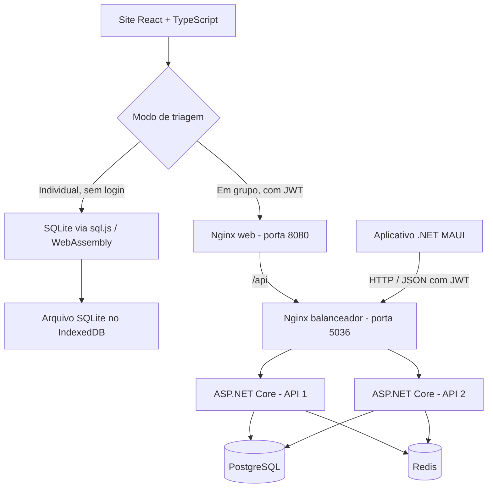

# Triar — Sistema de Triagens em Saúde

Aplicativo MAUI e site separado em React + TypeScript, com API ASP.NET Core.

## Linguagens e stack

| Camada | Linguagens | Tecnologias e finalidade |
|---|---|---|
| Aplicativo nativo | C# e XAML | .NET 10 e .NET MAUI; telas nativas e cliente HTTP da API. Distribuição prevista para Android, Windows e macOS via Mac Catalyst; o site oferece acesso pelo iOS. |
| Frontend web | TypeScript, HTML e CSS | React 19, React Router 7 e Vite 7; aplicação de página única (SPA), navegação e build. TypeScript 5.9 verifica os tipos. |
| Backend | C# | ASP.NET Core 10; API HTTP com JSON, controllers, serviços de aplicação e injeção de dependências. |
| Persistência compartilhada | SQL | PostgreSQL 17, Entity Framework Core 10 e provedor Npgsql; armazenamento dos usuários, triagens e resultados do modo em grupo. |
| Persistência individual web | TypeScript e SQL | SQLite com sql.js e WebAssembly; arquivo do banco armazenado no IndexedDB do navegador. |
| Cache da API | C# e configuração Redis | Redis 7 com `IDistributedCache`; cache compartilhado entre as duas instâncias da API. |
| Autenticação | C# | JWT Bearer; senhas com PBKDF2, autorização por usuário e limitação de requisições. |
| Exportação | C# e TypeScript | ClosedXML na API e no MAUI; write-excel-file no navegador, para gerar arquivos XLSX. |
| Infraestrutura | Dockerfile, YAML e configuração nginx | Docker e Docker Compose; nginx serve o frontend, encaminha requisições e balanceia as APIs. Node.js 24 compila o frontend na imagem de build. |
| Automação e testes | TypeScript, JavaScript e PowerShell | Playwright para testes de navegador; scripts para cache offline, geração do catálogo e integração da API. |

O Node.js é utilizado nas ferramentas de desenvolvimento e no build web. O backend da aplicação é ASP.NET Core; os arquivos web compilados são servidos pelo nginx.

## Arquitetura

O projeto separa a interface dos clientes, as regras de aplicação e a persistência. O aplicativo MAUI e o site são projetos independentes; no modo em grupo, ambos se conectam à API compartilhada. No site, a escolha inicial determina se as operações usam SQLite local ou HTTP para a API.



### Organização do backend

O fluxo principal é **Controllers → Services → DbContext → banco de dados**:

- `Controllers`: recebem requisições, exigem autenticação e retornam respostas HTTP.
- `Dtos`: definem os dados de entrada e saída dos endpoints.
- `Services`: executam regras de triagem, cálculo de pontuação, autenticação, geração de tokens e cache.
- `Models`: representam as entidades persistidas, como usuários, perguntas, respostas e resultados.
- `Data`: contém o `TriagemDbContext` do EF Core, o catálogo padrão, a carga inicial e a atualização aditiva do esquema.

As duas instâncias da API utilizam o mesmo PostgreSQL e o mesmo cache Redis. A segunda aguarda a primeira ficar saudável durante a inicialização. Triagens particulares e históricos são associados ao usuário autenticado.

### Organização do frontend

As telas React usam os contratos definidos em `src/models.ts`. O módulo `src/api.ts` direciona as operações conforme o modo escolhido: `src/local-db.ts` executa as operações no SQLite individual, enquanto o modo em grupo utiliza `/api` com JWT. Isso permite manter as telas e os fluxos de atendimento nos dois modos, com destinos de armazenamento distintos.

O catálogo web é gerado a partir do catálogo C# da API. A exportação individual é feita por `src/local-excel.ts`. Na produção, um service worker guarda os arquivos estáticos para permitir o uso individual offline após o primeiro carregamento; as chamadas da API não entram nesse cache.

### Persistência e futura nuvem

O SQLite individual pertence ao navegador e à origem do site: outros dispositivos, navegadores ou endereços não compartilham automaticamente esse banco. O modo em grupo centraliza os dados no PostgreSQL. A futura implantação em nuvem poderá hospedar o site, a API e o banco compartilhado, mantendo o SQLite individual local. Sincronização entre SQLite e PostgreSQL ainda não foi implementada.

O Compose principal executa seis serviços: frontend nginx, balanceador nginx, duas APIs, PostgreSQL e Redis. O banco PostgreSQL usa volume persistente. A configuração alternativa `docker-compose.individual.yml` utiliza SQLite no servidor da API e não é necessária para o modo individual do navegador.

## Modos na tela inicial do site

- **Individual:** sem login, SQLite real no navegador, sem envio de dados à API. Histórico e triagens persistem no IndexedDB. Há cópia do banco em Sobre. Limpar os dados do navegador apaga esse banco.
- **Em grupo:** cadastro/login, API ASP.NET e PostgreSQL, preparado para futura hospedagem compartilhada em nuvem. Não há sincronização automática dos bancos individuais.

## Executar

Mantenha o `.env` existente ou configure `.env.example` com `JWT_KEY` aleatória de pelo menos 32 caracteres e `POSTGRES_PASSWORD`.

```sh
docker compose up -d --build --wait
```

Site: http://localhost:8080. API MAUI: http://localhost:5036. Esse Compose oferece **os dois modos** na tela inicial, com PostgreSQL, Redis, duas APIs e nginx. Não use `down -v` para preservar os bancos.

Após o primeiro carregamento completo, a versão de produção guarda os arquivos para o modo individual offline. Publicação remota requer HTTPS. O aplicativo MAUI é instalado nos dispositivos; o Docker executa o site e os serviços.

## Estrutura

- `Triagem.App/MauiApp3`: aplicativo existente, preservado.
- `Triagem.Web`: site, SQLite local, telas responsivas e testes Chromium/WebKit.
- `Triagem.API/Triagem.API`: API .NET 10, PostgreSQL, autenticação JWT e isolamento por usuário.
- `docker-compose.yml`: implantação principal.
- `docker-compose.individual.yml`: alternativa especial com SQLite no servidor; não é necessária para o modo Individual do navegador.
- `database/script.sql`: referência histórica de SQL Server.

O site utiliza os sete protocolos e os recursos visuais do MAUI atualizado. Oferece perguntas sim/não e múltiplas opções, cadastro do paciente, resultado, histórico, Excel e criação/edição de triagens. A atualização do esquema da API adiciona os novos campos sem apagar históricos existentes.

Instruções de desenvolvimento, testes, limites do armazenamento local e geração do catálogo: [Triagem.Web/README.md](Triagem.Web/README.md).

> Projeto acadêmico: resultados orientativos, que não substituem avaliação profissional.
